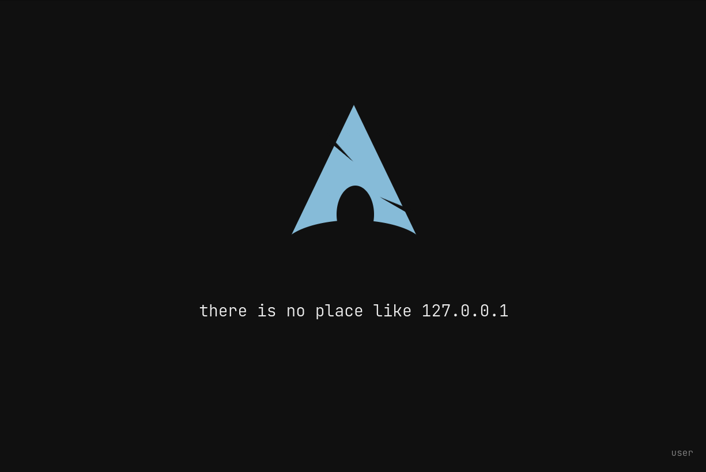

# lightdm-webkit2-monoarch

Very minimal greeter theme for lightdm webkit2.

_Heavily_ ~~plagerised from~~ inspired by `lightdm-webkit2-theme-arch` ([aur](https://aur.archlinux.org/packages/lightdm-webkit2-theme-arch/) / [gitlab](https://gitlab.com/kenogo/lightdm-webkit2-theme-arch) / [github](https://github.com/kenogo/lightdm-webkit2-theme-arch)), which used wallpapers from [reddit](https://www.reddit.com/r/archlinux/comments/4gc2lw/some_arch_wallpapers_i_made/?st=ivzxvmxu&sh=727d2f4e).
It's essentially the same thing, but all html/css rather than images. It also uses JetBrains Mono because it is a superior typeface<sup>_fight me_</sup>.

The username/password field is in the bottom right corner, you can't change a WM.

## Example



## Prerequisites

These should be installed and configured.

- `lightdm`
- `lightdm-webkit2-greeter`

## Installation

1. Clone the repo
    ```sh
    git clone git@github.com:timberhill/lightdm-webkit2-monoarch.git
    ```

2. Install the theme
    ```sh
    cd lightdm-webkit2-monoarch && ./install.sh
    ```

3. Reboot and all should be gut!

## Customisation

There are no config files, but it's quite simple to make some changes.

### Colours

The base colours are set in [`index.css`](index.css), tweak them at your will:

```css
:root {
  --background: #101010; /*kinda black*/
  --logo: #86BBD8;       /*light blue*/
  --input: #ededed;      /*white ish*/
  --headline: #ededed;   /*white ish*/
}
```
### Headline text

The text is chosen randomly from the list at the top of [`main.js`](main.js), feel free to add your own and/or raise a PR!

```javascript
headlines = [
    "if it ain't broke, break it",
    ...
]
```
